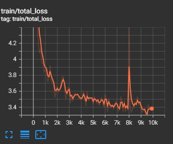

# QCLIP

This repository has been cloned from [PMC-CLIP](https://github.com/WeixiongLin/PMC-CLIP)

We concatenated Quantum ResNet-based CNN as a visual encoder via Pennylane and Torch with 4 qubits. The combined model trains contrastively on image-text pairs. Due to resource restrictions, this work stands only as a POC, and we were able to train for only 10 epochs, with each epoch taking around 4 hours on the Tesla T4 GPU. The final retrieval results will be reported in the report. 

The added Quantum model can be viewed [here](https://github.com/Shiva-sankaran/QLIP/blob/main/src/pmc_clip/model/blocks.py#L300)

The dataset and checkpoint is available at [Huggingface](https://huggingface.co/datasets/axiong/pmc-oa), [Baidu Cloud](https://pan.baidu.com/s/1mD51oOYbIOqDJSeiPNaCCg)(key: 3iqf).


- [QLIP](#QLIP)
  - [Usage](#usage)
    - [1. Create Environment](#1-create-environment)
    - [2. Prepare Dataset](#2-prepare-dataset)
    - [3. Training](#3-training)
    - [4. Evaluation](#4-evaluation)
  - [Acknowledgement](#acknowledgement)
  - [Contribution](#contribution)
  - [TODO](#todo)
  - [Cite](#cite)

## Usage

Repo Structure
```bash
src/:
    |--setup.py
    |--qlip/
    |   |--loss/
    |   |--model/: QLIP model and variants
    |   |--model_configs/
    |   |--factory.py: Create model according to configs
    |   |--transform.py: data augmentation
    |--training/
    |   |--main.py
    |   |--scheduler.py: Learning rate scheduler
    |   |--train.py
    |   |--evaluate.py
    |   |--data.py
    |   |--params.py
docs/: project pages
```

### 1. Create Environment

```bash
conda create -n qlip python=3.9
conda activate qlip

pip install -r requirements.txt
# pip install -i https://pypi.tuna.tsinghua.edu.cn/simple -r requirements.txt

python setup.py develop  # install qlip with dev mode
```

### 2. Prepare Dataset

Download from [Huggingface](https://huggingface.co/datasets/axiong/pmc-oa), [Baidu Cloud](https://pan.baidu.com/s/1mD51oOYbIOqDJSeiPNaCCg)(key: 3iqf).
Or follow the [Pipeline of PMC-OA Development](https://github.com/WeixiongLin/Build-PMC-OA) if you want to start from scratch.


### 3. Training

Single GPU
```bash
python -m training.main \
--dataset-type "csv" --csv-separator "," --save-frequency 5 \
--report-to tensorboard \
--train-data="path/to/train.csv" --val-data="path/to/valid.csv" \
--csv-img-key image --csv-caption-key caption \
--warmup 500 --batch-size=8 --lr=1e-4 --wd=0.1 --epochs=100 --workers=8 \
--model RN50_fusion4 --hugging-face --mlm --crop-scale 0.5
```

Multi GPU
```bash
CUDA_VISIBLE_DEVICES=0,1 torchrun --nproc_per_node=2 --rdzv_endpoint=$HOSTE_NODE_ADDR -m training.main \
--dataset-type "csv" --csv-separator "," --save-frequency 5 \
--report-to tensorboard \
--train-data="path/to/train.csv" --val-data="path/to/valid.csv" \
--csv-img-key image --csv-caption-key caption \
--warmup 500 --batch-size=128 --lr=1e-4 --wd=0.1 --epochs=100 --workers=8 \
--model RN50_fusion4 --hugging-face --mlm --crop-scale 0.5
```

<div class="third">
  
  
  
</div>


